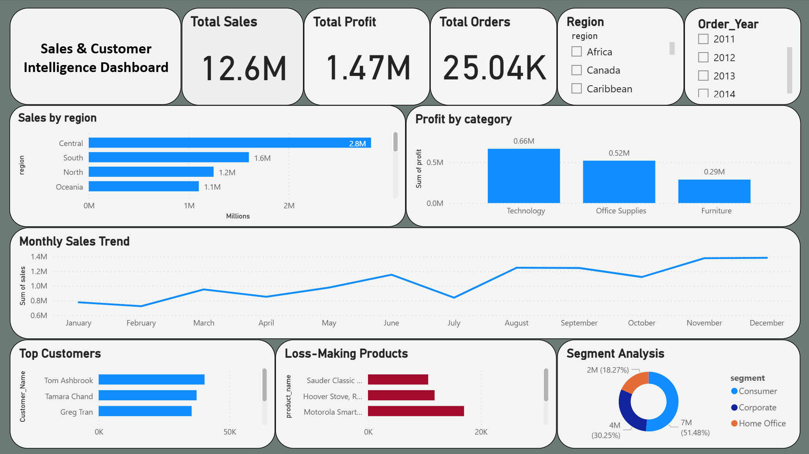

# 📊 Sales & Customer Intelligence Dashboard

## 🎯 About the Project

In this project, I analyzed a sales dataset to understand how revenue, customers, and products are performing. The goal was to identify trends and find useful business insights.

---

## 🛠️ Tools Used

* SQL
* Excel
* Power BI

---

## 📈 What I Did

* Analyzed sales and profit across different regions
* Compared profit performance by product categories
* Created a monthly sales trend analysis
* Identified top customers based on revenue
* Found products that are generating losses

---

## 🔍 Key Insights

* Central region contributes the highest sales
* Technology category generates the most profit
* Some products consistently lead to losses
* Sales show an overall increasing trend

---

## 📂 Project Files

* Sales_Dataset.csv → Raw dataset
* analysis_queries.sql → SQL queries used for analysis
* dashboard.png → Power BI dashboard

---

## 💡 Conclusion

This project helped me understand how to convert raw data into meaningful insights using SQL and Power BI.
